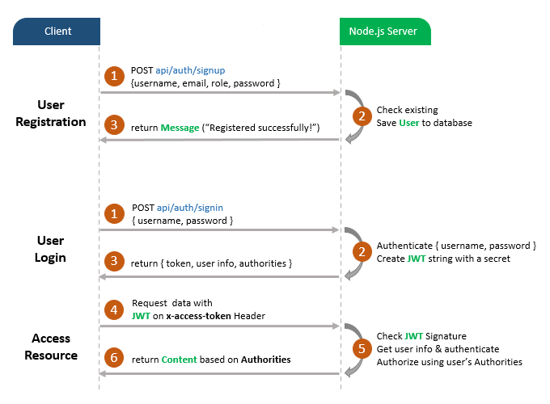
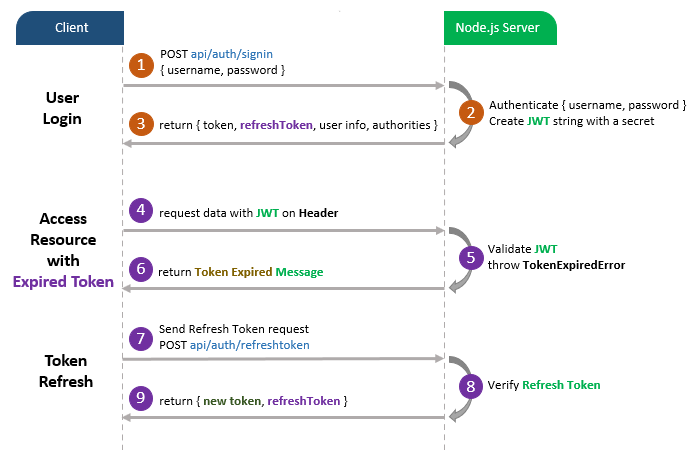

# BackEnd in NodeJS/Express MongoDB – User Authentication & Authorization with JWT & Mongoose

## User Registration, User Login and Authorization process.
The diagram shows flow of how we implement User Registration, User Login and Authorization process.



You may need to implement Refresh Token:



> Explained here: [Node.js JWT Refresh Token with MongoDB example](https://www.bezkoder.com/jwt-refresh-token-node-js-mongodb/)


## Project setup
```
npm install
```

### Run
```
node server.js
```

### Debug
```
npm run debug
chrome://inspect/#devices
```

### Test the API

Use pre-mad calls present in [REST/api.http](./REST/api.http)

### Links
[Blog node-js-mongodb-auth-jwt](https://www.bezkoder.com/node-js-mongodb-auth-jwt/)
[Code node-js-jwt-auth-mongodb](https://github.com/bezkoder/node-js-jwt-auth-mongodb)
[Run NodeJS in debug](https://yonatankra.com/how-to-remote-debug-and-profile-node-js-apps/)
[API file from IntelliJ](https://www.jetbrains.com/help/idea/exploring-http-syntax.html#enable-disable-saving-cookies)
